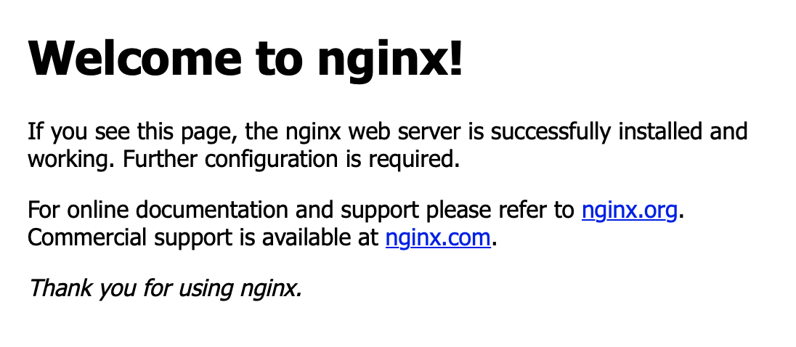

# :fa-flask: Lab 1: Erste Schritte mit Docker

* Docker bedient man auf der Kommandozeile. Der erste Befehl:

```
docker version
```

* Alle laufenden Container zeigt

```
docker ps
```

## 1. Der erste Container


Jeder Container besteht aus einem Image. Es enthält das Dateisystem mit allen Dateien, die für den Betrieb gebraucht werden.

Einen Container starten Sie mit `docker run <Name des Images>`. Ein Abbild für Linux-Experimente heißt `busybox`.

* Starten Sie Ihren ersten Container mit

```
docker run -it busybox
```

Der Parameter `-it` weist Docker an, dass der Container für eine interaktive Sitzung gestartet wird.

Wenn Sie genau hinsehen, bemerken Sie, dass Sie sich nicht mehr in der Konsole des Gastgebers befinden:

```bash
root@test1:~# docker run busybox
Unable to find image 'busybox:latest' locally
latest: Pulling from library/busybox
76df9210b28c: Pull complete
Digest: sha256:95cf004f559831017cdf4628aaf1bb30133677be8702a8c5f2994629f637a209
Status: Downloaded newer image for busybox:latest
/ #
```

* Sehen Sie sich im Dateisystem um.
* Schauen Sie sich die Netzwerkkonfiguration mit `ifconfig` an
* Versuchen Sie, eine Verbindung ins Internet herzustellen (z.B. `ping heise.de`)
* Verlassen Sie den Container mit `exit`

## 2. Der erste Server

Kommandozeilenwerkzeuge wie `busybox` sind nicht das natürliche Habitat für Docker-Container. Es ist Zeit für den ersten Serverdienst, einen kleinen Nginx-Webserver. Ein Image für Nginx heißt schlicht: `nginx`.

* Fahren Sie Ihren Server hoch:

```
docker run -p 80:80 nginx
```

Der neue Parameter `-p 80:80` richtet eine Portweiterleitung ein. Anfragen an Port 80 des Gastgebers landen am Port 80 des Containers.

Das Ergebnis sieht in etwa so aus:

```bash
root@test1:~# docker run -p 80:80 nginx
Unable to find image 'nginx:latest' locally
latest: Pulling from library/nginx
8559a31e96f4: Pull complete
8d69e59170f7: Pull complete
3f9f1ec1d262: Pull complete
d1f5ff4f210d: Pull complete
1e22bfa8652e: Pull complete
Digest: sha256:21f32f6c08406306d822a0e6e8b7dc81f53f336570e852e25fbe1e3e3d0d0133
Status: Downloaded newer image for nginx:latest
```

* Öffnen Sie die Adresse Ihres Test-Servers im Browser. Das Ergebnis sollte so aussehen:

{: style="width:50%"}

* Beobachten Sie währenddessen die Kommandozeile. Sie zeigt in Echtzeit die Log-Ausgaben.
* Beenden Sie den Server mit Strg+C.


### 2.2 Server im Hintergrund-Modus

Ein richtiger Server soll laufen, ohne dass eine Kommandozeile offen ist. Dafür gibt es den detached-Modus:

```
docker run -d -p 80:80 nginx
```

Ausgabe ist nur eine Zeile, die ausgewürfelte ID. Prüfen Sie im Browser, dass der Server läuft.

Dass der Container existiert, sehen Sie mit

```
docker ps
```

In der ersten Spalte sehen Sie die ID, in der letzten den Namen (Terminal auf die Breite aufziehen).

Wenn Sie im detached-Modus sehen wollen, was im Container passiert ist, öffnen Sie die Logs mit:

```
docker logs <id>
```


* Stoppen Sie Ihren Webserver:

```
docker stop <ID>
```

Der Browser findet die Seite nicht mehr, `docker ps` bleibt auch leer.

!!! note "Praxistipp: Angehalten ist nicht weg"
    Ein gestoppter Container ist nicht weg. Sie finden ihn mit `docker ps -a`. Erst mit einem `docker rm` ist er endgültig weg. Alle gestoppten Container entsorgen Sie mit:

    ```
    docker rm $(docker ps -aq)
    ```    

    Ein Befehl, den man leider garantiert vergisst und öfter braucht.

### 2.3 Arbeiten im Container

Die Willkommen-Seite soll einer eigenen Seite weichen. Starten Sie eine neue Instanz des Nginx-Servers:

```
docker run -d -p 80:80 --name test nginx
```

Durch den Parameter `--name test` hat er direkt den Namen `test` bekommen. Um im Container etwas zu ändern, können Sie in diesen hineinspringen:

```
docker exec -it test bash
```

Der Befehl `docker exec` führt ein Programm im Container aus. Das Programm in diesem Fall heißt `bash`. Nicht jedes Container-Abbild hat `bash` installiert. Nutzen Sie dann `sh`.

Die Beispiel-Datei liegt im Pfad "/usr/share/nginx/html". Navigieren Sie dorthin:

```
cd /usr/share/nginx/html
```

Zum Bearbeiten soll `nano` zum Einsatz kommen. Das Programm ist aber noch nicht installiert. Betrachten Sie den Container als weitgehend leeren Linux-Server. Der Nginx-Container basiert auf Debian Buster – das hat nichts mit dem System zu tun, auf dem Docker läuft! Die Demo-Server laufen mit Ubuntu.

In diesem Container ist `apt` der Paketmanager des Vertrauens. Installieren Sie `nano` und öffnen Sie die Webseite mit:

```bash
apt update
apt install nano
nano index.html
```

Nehmen Sie eine Änderung an der Datei vor und speichern Sie mit "Strg+O" und "Enter", verlassen Sie `nano` mit "Strg+X". Prüfen Sie im Browser den Erfolg Ihrer Änderung.

Mit `exit` verlassen Sie den Container wieder.

!!! warning "Manipulationen im Container"
    Manipulationen dieser Art im Container sind nur während der Einrichtung und bei der Fehlersuche sinnvoll. An einem Container in Produktion nimmt man keine Änderungen vor – was Sie dort ändern, ist flüchtig: Wird der Container ausgetauscht, verschwindet die Änderung. In einem der nächsten Kapitel erfahren Sie, wie man für dauerhafte Änderungen vorgehen muss. 

## 3. Bleibende Daten (Volumes)

Was im Container geschrieben wird, verschwindet nach dem Löschen. Das ist für Nutzdaten und Konfigurationen hinderlich. Damit etwas das Entsorgen eines Containers übersteht, müssen Sie ein sogenanntes Volume in den Container hineinreichen. Das ist im einfachsten Fall eine Datei oder ein Ordner auf dem Gastgeber.

Entsorgen Sie zunächst den Nginx-Container. Legen Sie dann auf dem Linux-Server im aktuellen Verzeichnis (z.B. dem Home-Verzeichnis) die Datei index.html mit Inhalt an, zum Beispiel mit:

```
echo "Container in der Praxis" > index.html
```

Diese Datei soll jetzt direkt in den Container weitergereicht werden:

```
docker run -d -p 80:80 -v ${PWD}/index.html:/usr/share/nginx/html/index.html --name testvolumes nginx
```

Für die Weiterleitung ist der Parameter `-v` verantwortlich. Vor dem Doppelpunkt steht der Pfad zur Datei oder zum Ordner auf der lokalen Maschine, nach dem Doppelpunkt das Ziel im Container.

Hinweis: Die Volumes müssen als absoluter Pfad angegeben werden. Daher kommt `${PWD}` zum Einsatz.

## 4. Zusammenfassung

Sie haben gesehen, wie Sie Container starten, stoppen, löschen, Ports und Volumes in den Container reichen.

Die wichtigsten Befehle in der Übersicht:

|Befehl|Funktion|Beispiel|
|---|---|---|
|`docker ps`|zeigt alle Container an|`docker ps -a`|
|`docker run`|führt einen Container aus|`docker run -it busybox sh`|
|`docker stop <id>`|beendet einen Container|`docker rm testserver`|
|`docker rm <id>`|entfernt einen beendeten Container|`docker rm testserver`|
|`docker rm $(docker ps -aq)`|alle gestoppten Container entsorgen| |