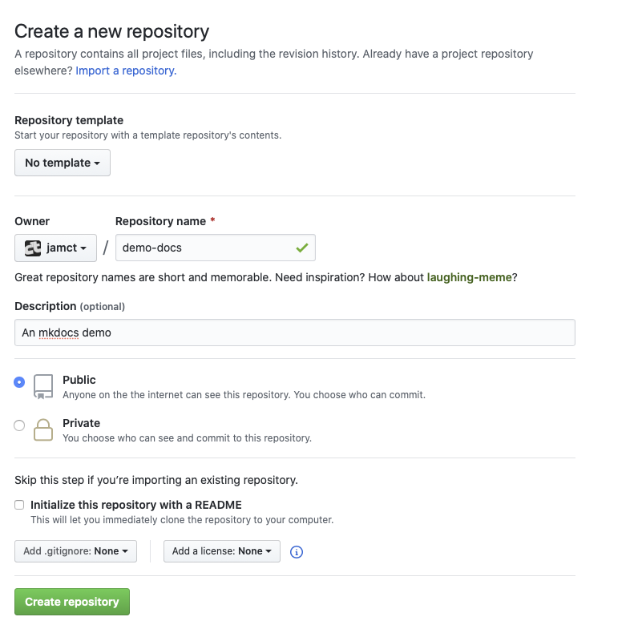

# :fa-flask: Lab 4: Ein gutes Image, automatisch gebaut

Zur Erininnerung: Bisher haben wir Images wie folgt gebaut:

Irgendwo auf der Festplatte des Servers haben wir ein `Dockerfile` angelegt und dieses per `docker build .` zu einem Image zusammengebaut. Ein solches Image könnte man mit `docker push <id>` in den Docker-Hub kopieren. Doch so flüchtig soll unser Produktivsystem nicht aufgebaut werden. In diesem Lab soll einmal systematisch eine Automation eingerichtet werden.

Voraussetzung um die Anleitung nachzuvollziehen, ist ein Account bei Docker und einer bei GitHub (letzteren dürften die meisten Admins und Entwickler haben). Hier geht es zum Anlegen der Accounts:

* [Account bei GitHub anlegen](https://github.com/join?ref_cta=Sign+up&ref_loc=header+logged+out&ref_page=%2F&source=header-home)
* [Account bei Docker anlegen](https://hub.docker.com/signup)

## 1. Das Repo für den Code

Als simples Beispiel soll ein Container mit der Open-Source-Dokumentationssoftware "MkDocs" gebaut werden. In diesen Container sollen die Inhalte der Dokumentation (die ebenfalls im Repository liegen) eingebacken werde. Der fertige Container soll also ohne Volumes einfach laufen und die komplette Doku ausliefern. Mit jedem Push ins Repo soll ein aktuelles Image erzeugt werden.

Die Reise beginnt bei einem GitHub-Repository für den Code. Legen Sie ein solches an: [https://github.com/new](https://github.com/new)
Das Repo darf grundsätzlich `public` oder `private` sein. Für das Beispiel nehmen Sie zunächst ein öffentliches Repo.



Das Repo für dieses Beispiel heißt `demo-docs`. Wenn Sie es anders nennen, müssen Sie später ggf. den Namen ändern.

## 1.2 Das Dockerfile

Dieses Lab soll auch die Denkweise veranschaulichen, wie man an das Bauen eines Images herangeht:

* Gibt es ein MkDocs-Image (am besten der Entwickler) -> nein
* Gibt es Drittanbieter-Images -> eher nein

Also muss ein eigenes Image her. Dazu lohnt ein Blick in die [Doku von MkDocs](https://www.mkdocs.org/#installing-mkdocs). Was dort steht, muss als Rezept in ein Dockerfile gelangen:

```
pip install --upgrade pip
pip install mkdocs
mkdocs serve
```

MkDocs läuft also mit Python und kommt mit dem Python-Paketmanager Pip auf eine Maschine. Als Basis-Image sollten wir uns nach Python umsehen. Die gute Nachricht: Es gibt ein offizielles Image und auch eins auf Alpine-Basis. Damit können wir ein `Dockerfile` im Repo anlegen:

```Dockerfile
FROM python:3-alpine
RUN pip install --upgrade pip && pip install mkdocs
EXPOSE 8080
CMD ["mkdocs", "serve"]
```

Was jetzt folgt, ist Versuch und Irrtum. Versuchen wir, dieses Dockerfile zu bauen:

```
docker build .
```

Der Bauvorgang beginnt vielversprechend, scheitert aber nach 30 Sekunden mit viel rotem Output:

```bash
[...]
    building 'regex._regex' extension
    creating build/temp.linux-x86_64-3.8
    creating build/temp.linux-x86_64-3.8/regex_3
    gcc -Wno-unused-result -Wsign-compare -DNDEBUG -g -fwrapv -O3 -Wall -DTHREAD_STACK_SIZE=0x100000 -fPIC -I/usr/local/include/python3.8 -c regex_3/_regex.c -o build/temp.linux-x86_64-3.8/regex_3/_regex.o
    unable to execute 'gcc': No such file or directory
    error: command 'gcc' failed with exit status 1
    ----------------------------------------
ERROR: Command errored out with exit status 1: /usr/local/bin/python -u -c 'import sys, setuptools, tokenize; sys.argv[0] = '"'"'/tmp/pip-install-iygh9d3r/regex/setup.py'"'"'; __file__='"'"'/tmp/pip-install-iygh9d3r/regex/setup.py'"'"';f=getattr(tokenize, '"'"'open'"'"', open)(__file__);code=f.read().replace('"'"'\r\n'"'"', '"'"'\n'"'"');f.close();exec(compile(code, __file__, '"'"'exec'"'"'))' install --record /tmp/pip-record-rzdtn9kz/install-record.txt --single-version-externally-managed --compile --install-headers /usr/local/include/python3.8/regex Check the logs for full command output.
The command '/bin/sh -c pip install --upgrade pip && pip install mkdocs' returned a non-zero code: 1
```

Jetzt gilt es, den Fehler zu finden und Google zu befragen. Der entscheidende Hinweis: `'gcc': No such file or directory`. Der Python-Paketmanager braucht also den C-Compiler `gcc` für irgendein Paket. Ein Detail, das uns die Doku von MkDocs verschwieg. Auf einem klassischen Server würden wir das nachinstallieren und dann vergessen. Beim Dockern wird man gezwungen, das anständig reproduzierbar zu bauen. Gcc gibt es per Alpine-Paketquellen im Paket `build-base` (sagte die Suchmaschine). Nächster Versuch, neu ist Zeile 2:

```
FROM python:3-alpine
RUN apk add build-base
RUN pip install --upgrade pip && pip install mkdocs
EXPOSE 8080
CMD ["mkdocs", "serve"]
```

Kopieren Sie diesen Schnipsel und lassen Sie Docker bauen.

!!! note "Schichten sparen"
    Während das läuft, eine Anmerkung zum `&&`. Damit kann ich unter Linux zwei Befehle aneinander kleben. Ich könnte auch für jeden Befehl eine Zeile mit `RUN` ins Dockerfile schreiben. Docker erzeugt aber für jede Zeile eine Schicht. Das sollte ich vermeiden, wo ich nur kann. Man könnte auch überlegen, das `apk add` in die Zeile zu setzen. Das spart beim Bauen später Zeit und beim Herunterladen ebenso.

Docker hat unterdessen gebaut und ein Image erzeugt, das man mal starten könnte.

```
docker run -p 80:8080 <id>
```

Der Container fährt hoch, stürzt aber sofort ab. Ab jetzt ist MkDocs aber lauffähig, es fehlt: der Inhalt.

Die Doku soll ja direkt im Repo liegen – dafür schaffen wir im Repo den Ordner `mkdocs`. Zunächst hätte MkDocs gern eine YAML-Datei mit Metadaten. Legen Sie die `mkdocs/mkdocs.yml` an:

```yaml
site_name: Test-Doku
dev_addr: "0.0.0.0:8080"
site_author: "Ihr Name"

markdown_extensions:
    - attr_list
    - admonition
nav:
    - Willkommen: index.md
```

Außerdem brauchen Sie einen weiteren Unterordner `docs` (eine Vorgabe von MkDocs) und darin eine `index.md` mit etwas Markdown-Text:

```
# Test

Das ist Markdown

* Test
* Test
```

Die Struktur des Repos sieht jetzt so aus:

```
Dockerfile
mkdocs
  mkdocs.yml
  docs
    index.md
```

Der ganze Ordner `mkdocs` soll beim Bau in den Container kopiert werden. Achtung: Das ist kein Volume! Der Ordner wird einmalig beim Bau kopiert, nicht zur Laufzeit.

```
FROM python:3-alpine
RUN apk add build-base
COPY ./mkdocs/ /mkdocs/
WORKDIR /mkdocs/
RUN pip install --upgrade pip && pip install mkdocs
EXPOSE 8080
CMD ["mkdocs", "serve"]
```

## 3. Die Automation

Zwei Registries bieten sich an: Die öffentliche Registry im Docker-Hub und die Paket-Registry von GitHub. Erstere ist schnell in Betrieb genommen. Klicken Sie im Repo auf "Packages" und wählen Sie dort "Docker":


GitHub bringt seit fast einem Jahr eine mächtige CI/DCD-Lösung mit. Sie reagiert z.B. auf Pushes ins Repo. Um Sie einzurichten, erstellen Sie die Datei `.github/workflows/docker.yml`. Passen Sie den Namen Ihres Repos an:

```yaml
name: Build docs

on:
  push:
    branches: [master]

jobs:
  build:
    runs-on: ubuntu-latest
    steps:
      - uses: actions/checkout@v2
      - uses: docker/build-push-action@v1
        with:
          dockerfile: Dockerfile
          path: .
          username: jamct
          password: ${{ secrets.GITHUB_TOKEN }}
          repository: jamct/workshop/docs
          registry: ghcr.io
          tags: latest
```

Ein paar Anmerkungen zum (groben) Verständnis: Die GitHub-Registry orientiert sich an den Repos. Innerhalb eines Repos kann es mehrere Images geben. Daher ist der Name des Containers auch länger: `jamct/workshop/docs:latest`.

Innerhalb des Repos gibt es ein Token (`${{ secrets.GITHUB_TOKEN }}`), mit dem sich der Actions-Worker an der Registry anmeldet.

Wenn Sie die Datei speichern, beginnt sofort die Action. Das dürfen Sie live verfolgen über den Reiter "Actions".


Danach sehen Sie das fertige Paket unter "1 package" im Reiter "Code".

Kopieren Sie den ganzen Pull-Befehl mit dem Namen heraus und fügen ihn im Server ein, zum Beispiel:

```
docker pull ghcr.io/jamct/workshow/docs:latest
```

Und anschließend

```
docker run -p 80:8080 ghcr.io/jamct/workshop/docs:latest
```


## 3.1.1 Private Registries

Ein Hinweis, wenn Sie eine private Registry nutzen wollen (zum Beispiel die von GitHub): Zum Anmelden sollten Sie nicht Ihr Kennwort, sondern ein Token nehmen. Das generieren Sie unter der Adresse

[https://github.com/settings/tokens](https://github.com/settings/tokens)

Angehakt sein müssen die Punkte `repo` und `read:packages`:


Anmelden an einer Registry können Sie sich mit:

```
docker login ghcr.io
Username: <Username>
Password: <das Token>
```

## 3.2 Image im Docker-Hub

(diesen Abschnitt empfehlen wir für das Selbststudium, das Prinzip ist sehr ähnlich):

* Melden Sie sich im Docker-Hub an
* Erstellen Sie mit "Create Repository" ein Repo und geben ihm einen Namen
* Erzeuen Sie ein Token unter https://hub.docker.com/settings/security
* Wechseln Sie zu GitHub und im Repo auf "Settings", dort auf "Secrets". Legen Sie das Secret `DOCKER_TOKEN` an und kopieren Sie das Token aus dem Docker-Hub hier hinein.

* Öffnen Sie die YAML-Datei `.github/workflows/docker.yml` und ergänzen Sie einen Block für den Docker-Hub:

```yaml
name: Build docs

on:
  push:
    branches: [master]

jobs:
  build:
    runs-on: ubuntu-latest
    steps:
      - uses: actions/checkout@v2
      - uses: docker/build-push-action@v1
        with:
          dockerfile: Dockerfile
          path: .
          username: jamct
          password: ${{ secrets.GITHUB_TOKEN }}
          repository: jamct/workshop/presentation
          registry: ghcr.io
          tags: latest
      # neue Action für den Hub:    
      - uses: docker/build-push-action@v1
        with:
          dockerfile: Dockerfile
          path: .
          username: jamct
          password: ${{ secrets.DOCKER_TOKEN }}
          repository: jamct/mkdocs
          tags: latest
```

Die Action läuft sofort an und pusht in den Hub.


# 4. Entwickeln mit Automationen im Alltag

Auf der eigenen Maschine zu entwickeln, macht Spaß. Einer der Vorteile von Docker: Ich kann mir eine Entwicklungsumgebung zum Mitnehmen bauen. Dafür legt man sich eine `docker-compose-dev.yml` ins Repo:

```yaml
version: "3.8"
services:
  docs:
    build:
      context: .
      dockerfile: Dockerfile
    ports:
      - 8080:8080
    volumes:
      - ./mkdocs/:/mkdocs
```

Diese Datei baut das Image bei der Ausführung und hängt den "Code", also die Doku als Volume ein (ein Volume überschreibt den Inhalt, der dort schon liegt). Als Entwickler kann man dieses Setup lokal hochfahren, die Doku schreiben und das Ergebnis direkt betrachten. Ist man zufrieden, pusht man den Code zu GitHub und der Container wird mit Änderungen gebaut (auch diese Doku zum Workshop wurde so entwickelt).

Zum Hochfahren:

```
docker compose -f docker-compose-dev.yml
```

!!! warning "Sicherheitstipp für Entwicklermaschinen"
    Wer im Unternehmensnetz Docker auf der eigenen Maschine laufen lässt und solche Entwicklungsumgebungen hochfährt, veröffentlicht sie auch auf der Netzwerkkarte des PCs. Sie ist also ggf. im Unternehmensnetz sichtbar (wenn keine Firewall auf der Maschine dazwischengeht). Das kann nützlich sein, um Kollegen in einem Meeting die Ergebnisse live vorzuführen.
    
    Wenn man zum Experimentieren mit produktiven Daten arbeitet, sollte man den Zugriff aber auf das Loopback-Interface einschränken. Das geht mit:
    
    ```
     - 127.0.0.1:80:8080
    ```

