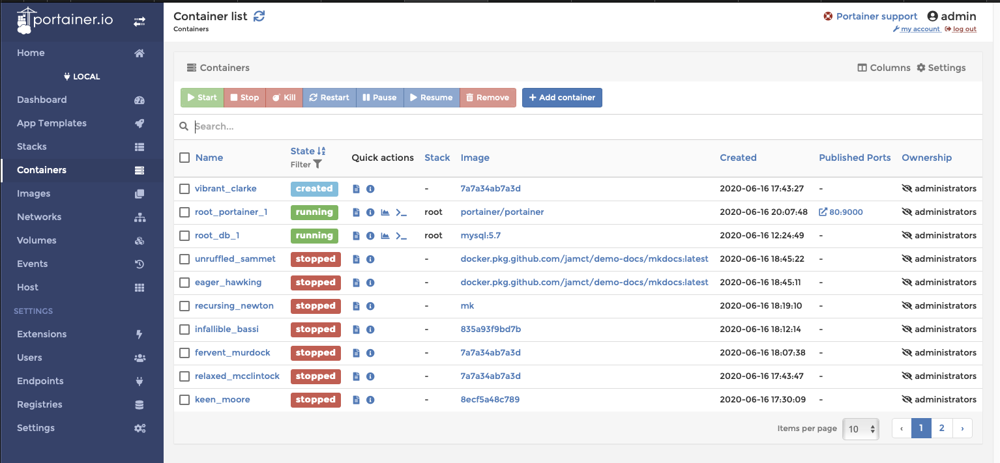

# :material-flask: Lab 5: Nützliche Helfer

Container lösen alte Problem und schaffen einige neue. Gegen diese gibt es ein paar nützliche Helfer.

## 1. Container updaten

Eine häufige Frage: Wie schaffe ich es, dass meine Images immer aktuell sind? Wie reagiere ich automatisch auf Updates durch die Maintainer? Ich will mich ja nicht aktiv mit meinen Containern beschäftigen!

Für diesen Zweck haben Entwickler des Unternehmens V2Tec das Image "Watchtower" erfunden. Diesen Compose-Schnipsel kann man auf einer Docker-Maschine einbauen:

```
  watchtower:
    image: containrrr/watchtower
    command: --cleanup --label-enable
    restart: always
    volumes:
      - /var/run/docker.sock:/var/run/docker.sock
      - ~/.docker/config.json:/config.json
```

Hier werden zwei erklärungsbedürftige Volumes verwendet:

- Die `config.json`. Sie liegt im Home-Verzeichnis und wird von Docker angelegt, wenn man sich an einer Registry anmeldet. Sie enthält die Base64-kodierten Token für die Registries. Damit kann Watchtower auch private Images updaten
- `/var/run/docker.sock` ist ein Unix-Socket und kann als Volume in den Container übergeben werden. Um diesen Socket zu verstehen, ist ein kleiner Exkurs nötig:


Die Docker-CLI und auch Docker-Compose sprechen mit diesem Socket. Wenn man den Socket in den Container übergibt, kann man Docker aus einem Container steuern (in diesem Fall: Images pullen und Container ersetzen). Das Volume

```
/var/run/docker.sock:/var/run/docker.sock
```

werden Sie immer dann finden, wenn Sie ein Image nutzen, das irgendwas mit Docker-Containern anstellt. Soll der Container nur auf dem Socket lesen, können Sie das einschränken:

```
/var/run/docker.sock:/var/run/docker.sock:ro
```

## 1.2. Container updaten lassen

In der Einstellung oben (`--label-enable`) schaut Watchtower minütlich für alle Container mit einem speziellen Label, ob es ein neues Image gibt. Das Label heißt `com.centurylinklabs.watchtower.enable=true` (bei der Firma centurylinklabs haben die Entwickler früher mal gearbeitet und das nie geändert):

```
  docs:
    image: nginx:alpine
    restart: always
    labels:
      - "com.centurylinklabs.watchtower.enable=true"
```

Aktualisieren die Nginx-Macher ihr Image, haben Sie es maximal eine Minute später im Produktivsystem. Gleiches gilt für eigene Container – vom Push bis zum Produktivsystem können weniger als 5 Minuten vergehen. So langsam fügen sich die Teile zusammen...

## 2. Grafische Oberflächen

Docker bedient man meist auf der Kommandozeile, oder – noch besser – gar nicht (weil Automationen den Job erledigen). Gerade auf Servern, die von vielen Nutzern zum Dockern benutzt werden, will man vielleicht aber mal überprüfen, was auf dem Host passiert und das ggf. auch Nicht-Entwicklern zeigen. Eine Kommandozeile ist da nicht der richtige Weg. Für diese Zielgruppe gibt es grafische Oberflächen. Eine gute Wahl ist die Open-Source-Oberfläche _Portainer_.

Zum Betrieb reicht der Compose-Schnipsel:

```
  portainer:
    image: portainer/portainer-ce
    ports:
     - 80:9000
    restart: always
    volumes:
     - /var/run/docker.sock:/var/run/docker.sock
     - ./portainer:/data
```


