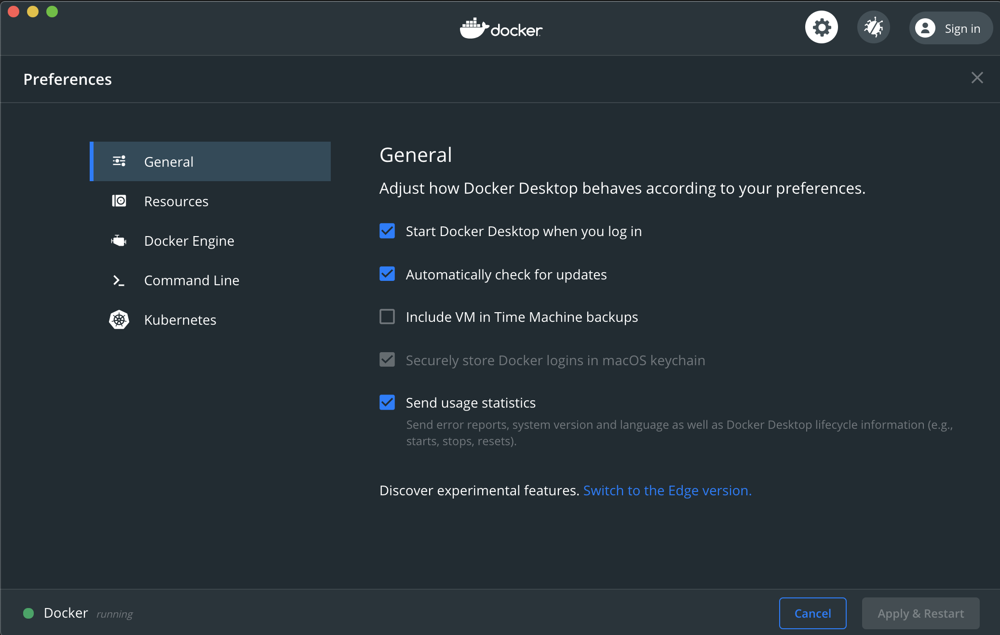

# :fa-wrench: Docker einrichten

Die Software Docker hat das Unternehmen Docker Inc. ursprünglich in zwei Varianten angeboten: *Docker Enterprise* und *Docker Community*. Nachdem die Enterprise-Sparte an Mirantis verkauft wurde, ist nur noch die Open-Source-Software *Docker Community* interessant.

## Für Windows und macOS

Es gibt die Software als Desktop-Version mit grafischer Oberfläche zum Download. Wählen Sie am besten die Stable-Variante, Edge enthält Beta-Funktionen:

* [Download bei Docker Inc.](https://www.docker.com/products/docker-desktop)

{: style="width:50%"}

## Für Linux und Linux-Server

Linux-Desktop-Nutzer müssen ohne grafische Oberfläche auskommen (was nicht schwerfällt). Auf dem Server gibt es ohnehin keinen Grund für grafische Oberflächen.

Die Paketquellen der gängigen Linux-Distributionen sind keine geeignete Anlaufstelle. Die Container-Welt ist zu schnelllebig.

Es gibt Paketquellen (.deb und .rpm) [direkt von Docker Inc.](https://docs.docker.com/engine/install/). Der schnellste Weg zur Docker-Engine auf dem Server ist das Installations-Skript:

```bash
curl -fsSL https://get.docker.com -o get-docker.sh
sudo sh get-docker.sh
```

Das Skript lädt Docker herunter und installiert es. Anschließend sollten Sie den aktuellen Benutzer zur Gruppe `docker` hinzufügen, damit Sie auch als normaler Benutzer auf den Docker-Daemon und die laufenden Container einwirken können:

```
sudo usermod -aG docker $USER
```

### Docker-Compose

Unter Windows und macOS müssen Sie Docker-Compose nicht separat installieren, es ist Teil der Desktop-Umgebung.

Unter Linux gibt es ebenfalls einen Zweizeiler:

```
sudo curl -L "https://github.com/docker/compose/releases/download/1.26.0/docker-compose-$(uname -s)-$(uname -m)" -o /usr/local/bin/docker-compose

sudo chmod +x /usr/local/bin/docker-compose
```
